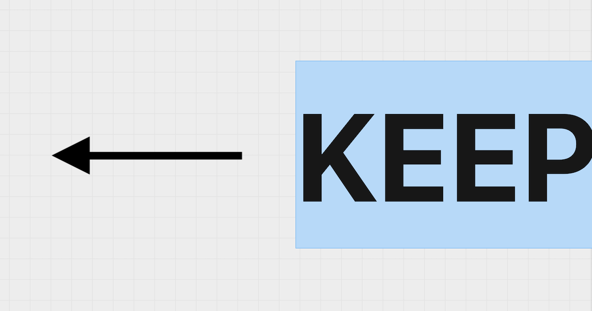

# Scrollex heading



## Features

- Mobile friendly.
- Accessibility friendly.

## Tech Stack

- [Next.js](https://nextjs.org/) - Framework.
- [Tailwind CSS](https://tailwindcss.com/) - Styling.
- [Scrollex](https://scrollex-docs.vercel.app/) - Animation.

## Run Locally

```bash
$ git clone https://github.com/untitled-lab/scrollex-heading.git
$ cd scrollex-heading
$ pnpm install
$ pnpm dev
```

## Acknowledgements

- Using [Not a Number](https://www.nan.fyi/)'s UI.

## License

[MIT](https://choosealicense.com/licenses/mit/)
